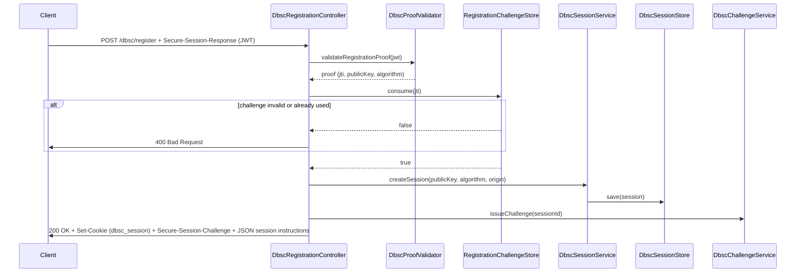
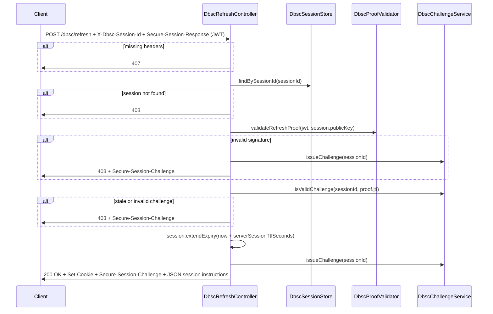
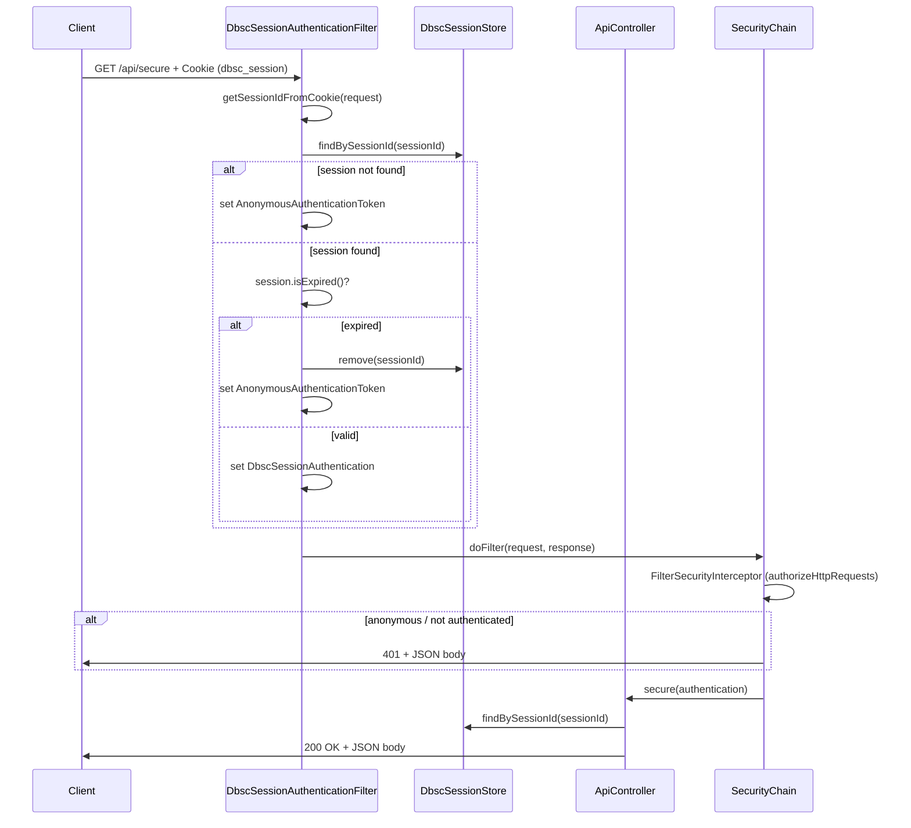
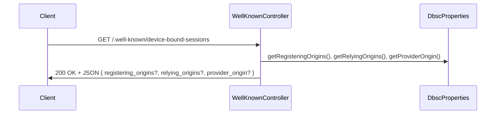
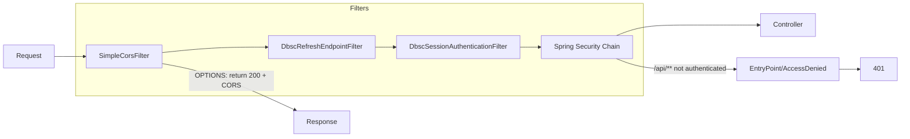

# DBSC Flow Diagrams

Mermaid diagrams for all flows in the codebase. View in any [Mermaid](https://mermaid.js.org/)-compatible viewer (e.g. GitHub, VS Code with Mermaid extension).

---

## 1. Session start flow

**Entry:** `GET /dbsc/session/start`  
**Controller:** `SessionStartController`

```mermaid
sequenceDiagram
    participant Client
    participant SessionStartController
    participant RegistrationChallengeStore

    Client->>SessionStartController: GET /dbsc/session/start
    SessionStartController->>SessionStartController: generateRegistrationChallenge()
    SessionStartController->>RegistrationChallengeStore: put(challenge, expiresAt)
    SessionStartController->>Client: 200 OK + Secure-Session-Registration: (ES256);path="/dbsc/register";challenge="..."
    Note over Client: Client parses challenge and path for registration
```

---

## 2. Registration flow

**Entry:** `POST /dbsc/register` with header `Secure-Session-Response: <JWT>`  
**Controller:** `DbscRegistrationController`



---

## 3. Refresh flow

**Entry:** `POST /dbsc/refresh` with headers `X-Dbsc-Session-Id` (or `Sec-Secure-Session-Id`) and `Secure-Session-Response: <JWT>`  
**Controller:** `DbscRefreshController`



---

## 4. Protected API / authentication flow

**Entry:** `GET /api/secure` (or any `/api/**`)  
**Filter:** `DbscSessionAuthenticationFilter` → **Controller:** `ApiController`



---

## 5. Test page: Call protected API (with auto-refresh)

**Entry:** User clicks "Call /api/secure" in `index.html`

```mermaid
flowchart TD
    A[User clicks Call /api/secure] --> B[fetch GET /api/secure with credentials]
    B --> C{Response OK?}
    C -->|200| D[Show 200 + body]
    C -->|401 or 403| E{Have keyPair, sessionId, nextChallenge?}
    E -->|No| F[Show error: cookie expired, register again]
    E -->|Yes| G[doRefresh: POST /dbsc/refresh with X-Dbsc-Session-Id + signed JWT]
    G --> H{Refresh 200?}
    H -->|No| F
    H -->|Yes| I[Retry fetch GET /api/secure]
    I --> J{Response OK?}
    J -->|200| K[Show 200 + body + "Cookie had expired; new cookie obtained via refresh"]
    J -->|4xx| F
```

---

## 6. Well-known flow

**Entry:** `GET /.well-known/device-bound-sessions`  
**Controller:** `WellKnownController`



---

## 7. Request filter chain (security pipeline)

Order of filters for an incoming request (e.g. to `/api/secure` or `/dbsc/refresh`):



- **SimpleCorsFilter:** Adds CORS headers; for `OPTIONS`, returns 200 immediately.
- **DbscRefreshEndpointFilter:** For `/dbsc/refresh`, adds `X-Frame-Options: DENY`.
- **DbscSessionAuthenticationFilter:** Reads `dbsc_session` cookie, looks up session (and checks expiry), sets `DbscSessionAuthentication` or `AnonymousAuthenticationToken`.
- **Spring Security:** Enforces `permitAll()` for `/dbsc/**`, `authenticated()` for `/api/**`; 401 for anonymous on `/api/**`.

---

## 8. End-to-end: Happy path (register → call API → cookie expires → refresh → call API)

```mermaid
sequenceDiagram
    participant User
    participant TestPage
    participant Server

    User->>TestPage: Start session
    TestPage->>Server: GET /dbsc/session/start
    Server->>TestPage: 200 + Secure-Session-Registration (challenge)

    User->>TestPage: Register
    TestPage->>TestPage: Generate ES256 key, sign JWT (jti=challenge)
    TestPage->>Server: POST /dbsc/register + Secure-Session-Response
    Server->>TestPage: 200 + Set-Cookie (dbsc_session) + Secure-Session-Challenge

    User->>TestPage: Call /api/secure
    TestPage->>Server: GET /api/secure + Cookie
    Server->>TestPage: 200 OK

    Note over TestPage,Server: Cookie expires (e.g. 30s); server session still valid (e.g. 120s)

    User->>TestPage: Call /api/secure (no cookie sent)
    TestPage->>Server: GET /api/secure
    Server->>TestPage: 401
    TestPage->>TestPage: doRefresh: sign JWT with cached challenge
    TestPage->>Server: POST /dbsc/refresh + X-Dbsc-Session-Id + Secure-Session-Response
    Server->>TestPage: 200 + Set-Cookie + Secure-Session-Challenge
    TestPage->>Server: GET /api/secure + Cookie (retry)
    Server->>TestPage: 200 OK
```

---

## 9. Stolen cookie scenario (no refresh possible)

```mermaid
sequenceDiagram
    participant Attacker
    participant Safari
    participant Server

    Note over Attacker: Steals dbsc_session cookie value from Chrome
    Attacker->>Safari: Use cookie in different browser
    Safari->>Server: GET /api/secure + Cookie (stolen)
    Server->>Safari: 200 OK (session valid, not expired)

    Note over Server: After serverSessionTtlSeconds (e.g. 120s) from last refresh by real user
    Safari->>Server: GET /api/secure + Cookie (stolen)
    Server->>Server: session.isExpired() → true, remove(sessionId)
    Server->>Safari: 401

    Note over Safari: Attacker cannot refresh (no private key); cookie may also have expired in browser (Max-Age=30)
```
